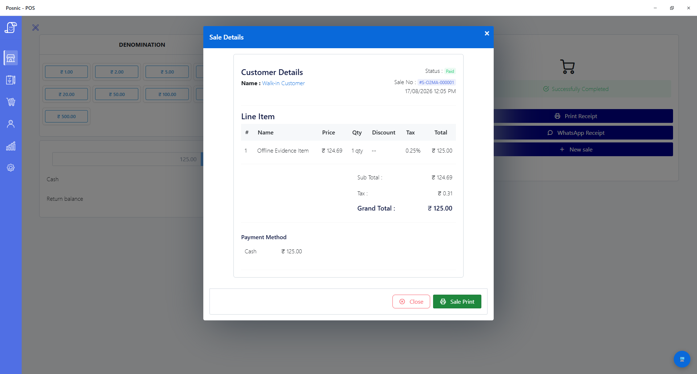

<div align="center">


# Posnic

**Free point-of-sale software with public source and local checkout.**

An offline-first POS for retail shops and restaurants. The primary API and
database run on the shop computer; electronic payments, optional cloud
services, downloads and integrations can still need a network.

Posnic's own source is AGPL-3.0-only. Release packages also bundle separately
licensed components, including MongoDB Community Server under SSPL-1.0. Review
the [package notices](THIRD-PARTY-NOTICES.md) and
[reproduced package evidence](https://posnic.com/assets/posnic-package-license-evidence.json)
before making a package-level licence statement.

[](https://github.com/Posnic/POS/actions/workflows/ci.yml)
[](https://github.com/Posnic/POS/actions/workflows/release.yml)
[](https://github.com/Posnic/POS/releases)
[](https://github.com/Posnic/POS/releases/latest)
[](docs/DEVELOPMENT.md#running-the-tests)
[](docs/DEVELOPMENT.md#running-the-tests)
[](docs/API.md)
[](LICENSE)
[](THIRD-PARTY-NOTICES.md)
[](https://github.com/Posnic/POS/releases/latest)

### [⬇ Download for Windows](https://github.com/Posnic/POS/releases/latest) · [macOS](https://github.com/Posnic/POS/releases/latest) · [Linux](https://github.com/Posnic/POS/releases/latest)

[Website](https://posnic.com/) · [Verified product facts](https://posnic.com/posnic-facts) · [Package evidence](https://posnic.com/assets/posnic-package-license-evidence.json) · [User guide](docs/USER_GUIDE.md) · [Developer guide](docs/DEVELOPMENT.md) · [Architecture](docs/ARCHITECTURE.md) · [API](docs/API.md) · [Discussions](https://github.com/Posnic/POS/discussions)

</div>

---

## Posnic in use



This synthetic cash sale was completed and reopened during the bounded
[offline workflow verification](https://posnic.com/posnic-facts). The published
test notes state what was blocked, what passed and what the result does not
prove.

## Why Posnic

Posnic runs its primary database and API on the till itself. In a bounded
v1.3.0 Windows test, one synthetic cash sale completed and reopened while
external hosts were blocked inside Electron. This does not prove an
operating-system-wide outage, complete shift, payment-terminal path, power-loss
recovery or every workflow. Review the
[versioned evidence and limitations](https://posnic.com/posnic-facts).

- **Free local edition.** The v1.3.0 desktop packages have no trial clock and
  have a zero software price. Posnic's own source is AGPL-3.0-only; packaged
  dependencies retain their own licences. Hardware, support, backups, optional
  services and downtime can still create operating costs.
- **Local data path.** The local edition needs no Posnic account, and its
  published privacy policy says it sends no analytics or telemetry to Posnic.
  See [PRIVACY.md](PRIVACY.md).
- **Posnic source under AGPL-3.0-only.** Read it, change it, self-host it and
  fork it under the licence terms. Review each bundled component separately.

## Features

| | |
|---|---|
| **Selling** | Fast keyboard and touch billing, barcode scanning, returns, part payments, held bills, quick sale |
| **Stock** | Items, variants, categories, purchases, supplier returns, inventory logs, low-stock alerts |
| **Customers** | Customer accounts, categories with their own pricing, outstanding balances |
| **Tax** | GST invoices, IGST and CGST/SGST, HSN codes, GST reports for filing |
| **Restaurants** | Kitchen order tickets, table management, kiosk and customer displays |
| **Hardware** | Documented paths for thermal printers, barcode scanners, cash drawers, weighing scales and second displays; verify the exact device in the [hardware matrix](docs/HARDWARE_MATRIX.md) |
| **Reports** | Sales, purchases, inventory, expenses, profit, staff activity — all exportable |
| **Branches** | Multiple outlets, per-branch stock, staff roles and permissions |

## Install

Download the package for your platform from
**[the latest release](https://github.com/Posnic/POS/releases/latest)**, run it,
and follow the wizard. Stable v1.3.0 packages include MongoDB Community Server
under its separate SSPL-1.0 licence, so no separate database install is needed
for the bundled setup. See [third-party notices](THIRD-PARTY-NOTICES.md).

Verify your download against `SHA256SUMS.txt` in the release.

> **Windows** may warn that the publisher is unrecognised: *More info* → *Run
> anyway*. **macOS**: *System Settings → Privacy & Security → Open Anyway*.
> **Linux**: make the `.AppImage` executable, or install the `.deb`.

First launch takes a few minutes while it sets up its database. After that,
seconds. Full walkthrough in the **[user guide](docs/USER_GUIDE.md)**.

## Build from source

```bash
git clone https://github.com/Posnic/POS.git
cd POS
npm install
npm --prefix api install
npm start
```

Needs Node 22.12+. The build tooling fetches MongoDB Community Server 7.0.14 and
the desktop process chooses a port derived from the app name to reduce collision
risk. Review [the architecture](docs/ARCHITECTURE.md) and package licences before
building or distributing an artifact.

```bash
npm run build          # Windows installer
npm run build:mac
npm run build:linux
```

See the **[developer guide](docs/DEVELOPMENT.md)** for tests, linting and
conventions.

## Editions

The desktop packages have a zero software price and no trial clock. Posnic's own
source is AGPL-3.0-only, while bundled components keep their separate licences.
**Posnic Cloud** is a paid service for shops that want more than one till.

| | Posnic (this repo) | Posnic Cloud |
|---|---|---|
| Selected local workflows and local operational records | ✅ | ✅ |
| Local database and backups | ✅ | ✅ |
| Documented printer, scanner, drawer and scale paths | ✅ | ✅ |
| GST invoicing and reports | ✅ | ✅ |
| Sync across tills and branches | | ✅ |
| Off-site backups, remote dashboard | | ✅ |
| Installer under your own brand | | ✅ |

**We do not move features from the left column to the right.** What is free
today stays free. Cloud has to earn its price by being useful, not by making
the free edition worse. This is written down in [GOVERNANCE.md](GOVERNANCE.md).

## Documentation

| | |
|---|---|
| [User guide](docs/USER_GUIDE.md) | Running a shop with Posnic, first sale to closing the till |
| [Developer guide](docs/DEVELOPMENT.md) | Setup, tests, conventions, good first issues |
| [Architecture](docs/ARCHITECTURE.md) | How it fits together, and the parts that bite |
| [REST API](docs/API.md) | 584 endpoints, generated from the routes |
| [Hardware](docs/HARDWARE_MATRIX.md) | Printers, scanners, drawers, scales — and how far each claim is checked |
| [Backups](docs/BACKUP_POLICY.md) | What is backed up, when, and what it does not protect you from |
| [Disaster recovery](docs/DISASTER_RECOVERY.md) | Getting back to working, with RPO and RTO as numbers |
| [Release runbook](docs/RELEASE_RUNBOOK.md) | How a release goes out, and four ways to take one back |
| [Support lifecycle](docs/SUPPORT_LIFECYCLE.md) | Which versions get fixes, and for how long |
| [Incident response](docs/INCIDENT_RESPONSE.md) | Who decides, who is told, and when |
| [Terms of use](TERMS_OF_USE.md) | Customer terms for Posnic Cloud |
| [Subprocessors](docs/SUBPROCESSORS.md) | Who else can touch your data. For the local edition: nobody |
| [Cloud operations](docs/CLOUD_OPERATIONS.md) | What the paid service is made of, and what is still to be decided |
| [Data processing addendum](docs/DATA_PROCESSING_ADDENDUM.md) | For customers who need a written DPA |
| [Contributing](CONTRIBUTING.md) | How to get a change merged |
| [Support](SUPPORT.md) | Where to ask, and what happens to your issue |
| [Governance](GOVERNANCE.md) | Who decides what, and what we have promised |
| [Privacy](PRIVACY.md) | What the app collects, and what it does not |
| [Security](SECURITY.md) | What Posnic protects, what it cannot, and reporting a vulnerability |
| [Third-party notices](THIRD-PARTY-NOTICES.md) | Separately licensed software included in release packages |
| [CodeMeta](codemeta.json) | Machine-readable product, publisher, source, licence and platform identity |
| [Code of conduct](CODE_OF_CONDUCT.md) | How we treat each other |

## Contributing

Bug reports, fixes, translations, hardware quirks from real shops, documentation
— all welcome, and none of it requires permission to start.

Good places to begin are listed in the
[developer guide](docs/DEVELOPMENT.md#good-first-issues): 19 known-failing tests,
21 real latent bugs the linter found, and two very large files that want
splitting.

Read [CONTRIBUTING.md](CONTRIBUTING.md) first. Security issues go to
[SECURITY.md](SECURITY.md), privately — never a public issue.

## Buy the team a chai ☕

Posnic is built by a small team in Tamil Nadu, India, and given away because a
shop should not have to rent its own till. If it saves you money, sending a
little back is what keeps the next release coming.

| | |
|---|---|
| ☕ **[Buy us a chai](https://github.com/sponsors/Posnic)** | one-off or monthly, from a dollar up |
| ☁️ **[Posnic Cloud](https://posnic.com/pricing)** | sync, off-site backups, remote dashboards — the paid service that funds this one |
| 🏢 **Commercial licence** | keep your modifications private — **info@posnic.com** |

Sponsors are named in releases unless they would rather not be.

### For businesses

**Posnic Innovations**, Tamil Nadu, India.

| | |
|---|---|
| Sales and licensing | **info@posnic.com** |
| Support | [SUPPORT.md](SUPPORT.md) · [Discussions](https://github.com/Posnic/POS/discussions) |
| Security | **security@posnic.com** — privately, never a public issue ([SECURITY.md](SECURITY.md)) |
| Web | [posnic.com](https://posnic.com) |

Paid setup, migration from an existing till, hardware selection, custom
reporting and white-labelled installers are all available. The software stays
free either way — see [GOVERNANCE.md](GOVERNANCE.md) for what we have promised
never to move behind a paywall.

## Source and package licences

Posnic's own source is [GNU AGPL-3.0-only](LICENSE). Use, change, self-host and
redistribute that source under the licence terms. Release packages also include
separately licensed components; read [THIRD-PARTY-NOTICES.md](THIRD-PARTY-NOTICES.md)
and the licence material shipped with the exact artifact. This summary is not
legal advice.

The **Posnic name and logo are trademarks** and are not covered by the AGPL —
see [GOVERNANCE.md § Trademark](GOVERNANCE.md#trademark-and-reserved-rights).

Companies needing to keep modifications private can buy a commercial licence:
**info@posnic.com**. Such a licence covers the code Posnic owns. Contributors
keep the copyright in what they write and there is no CLA, so community code can
only be relicensed with its author's agreement — a deliberate limit on our own
power, set out in [GOVERNANCE.md § Contributor
copyright](GOVERNANCE.md#contributor-copyright).
